# Tarea 1 Unidad 2: Consultas Avanzadas y Relaciones en MongoDB

## Portada

**Título del proyecto:**  
Tarea 1 Unidad 2: Consultas Avanzadas y Relaciones en MongoDB

**Nombre completo del estudiante:**  
Melany Rosmery Moreira Zambrano

**Carrera / Curso:**  
Ingeniería en Tecnologías de la Información

**Fecha de entrega:**  
01 de julio de 2025

**Enlace de Github**
[Enlace a Github](https://github.com/MelanyMoreiraZambrano/Tarea1U2_MoreiraMelany.git)
---

## Introducción

Esta práctica tiene como objetivo demostrar el manejo de consultas avanzadas y relaciones en bases de datos NoSQL utilizando MongoDB. Se exploran consultas complejas y relaciones entre colecciones, fundamentales para el modelado de datos flexible y eficiente en aplicaciones modernas.

---

## Entorno de Desarrollo

### Configuración del entorno

El entorno se configuró utilizando Docker Compose, permitiendo levantar instancias tanto de MongoDB como de Mongo Express para la administración gráfica de la base de datos.

### Instalación de dependencias

Las dependencias principales instaladas fueron:

- `mongoose`: Para el modelado de datos en Node.js.
- `dotenv`: Para el manejo de variables de entorno.

**Figura 1 y 2: Instalación de dependencias y ejecución del proyecto**  
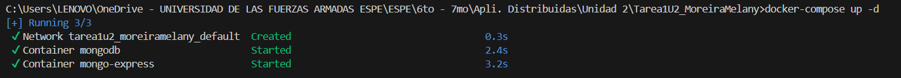
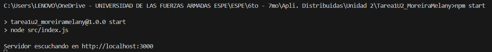

---

## Modelado de Datos

El modelo de datos implementa colecciones para usuarios, laboratorios y equipos, relacionándolos entre sí:

- **Usuarios**: Información de los usuarios.
- **Laboratorios**: Espacios con equipos asignados.
- **Equipos**: Dispositivos asignados a laboratorios y relacionados con usuarios.

Las relaciones implementadas incluyen:
- Uno a muchos: Un laboratorio tiene varios equipos.
- Muchos a uno: Un equipo pertenece a un laboratorio.
- Uno a muchos: Un usuario puede registrar varios equipos.

**Estructura de las colecciones y relaciones:**
- Usuarios ←→ Equipos ←→ Laboratorios (referencias con ObjectId)

---

## Desarrollo de Consultas

A continuación se presentan las consultas implementadas en el proyecto, cada una con su respectiva captura y explicación:

### Consulta 1: Listar todos los usuarios

**Descripción:**  
Uso básico de `.find()` para obtener todos los documentos de la colección de usuarios.

```js
const usuarios = await Usuario.find();
  console.log('Usuarios:', usuarios);
```

**Figura 3: Listar todos los usuarios**  
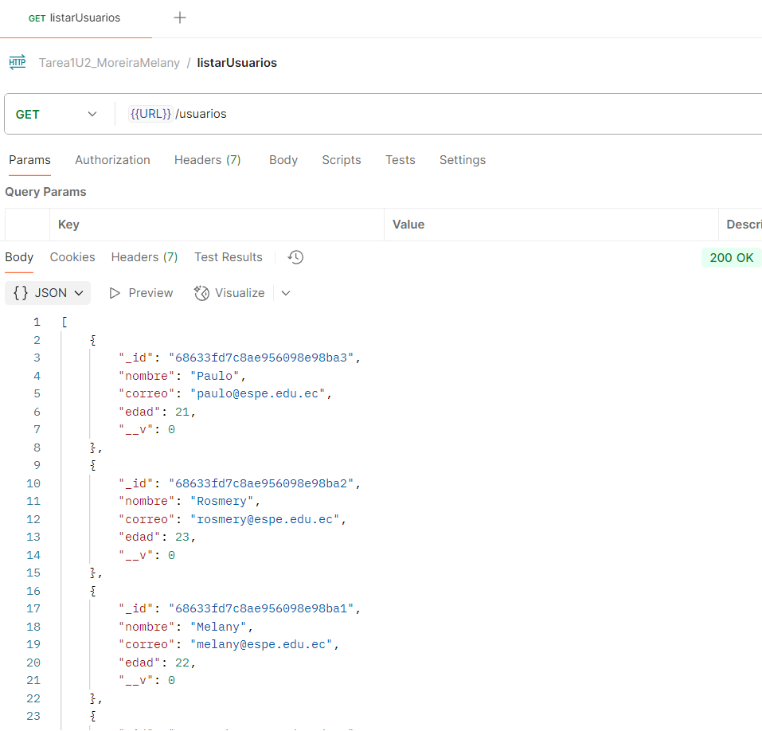

---

### Consulta 2: Buscar laboratorios que tengan equipos disponibles

**Descripción:**  
Uso de `.find({ estado: 'disponible' })` para filtrar laboratorios con equipos disponibles.

```js
app.get('/laboratorios/disponibles', async (req, res) => {
  const equiposDisponibles = await Equipo.find({ estado: 'disponible' }).populate('laboratorio');
  const laboratorios = equiposDisponibles.map(e => e.laboratorio);
  res.json(laboratorios);
});
```

**Figura 4: Buscar laboratorios con equipos disponibles**  
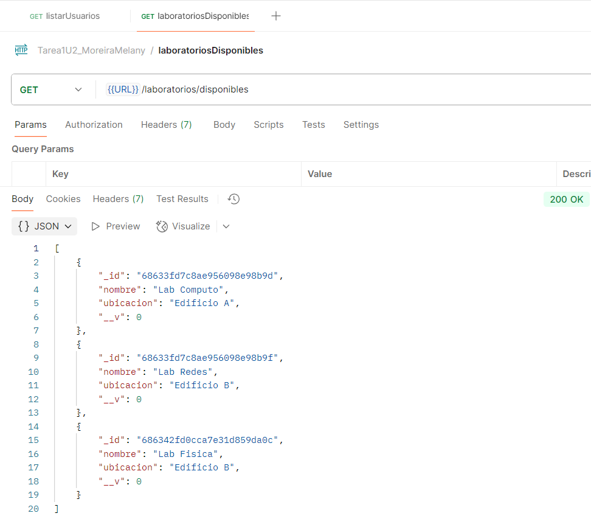

---

### Consulta 3: Contar cantidad de equipos por estado

**Descripción:**  
Uso de `.countDocuments()` para obtener el número de equipos según su estado.

```js
app.get('/equipos/estado/:estado', async (req, res) => {
  const count = await Equipo.countDocuments({ estado: req.params.estado });
  res.json({ estado: req.params.estado, cantidad: count });
});
```

**Figura 5: Contar cantidad de equipos por estado**  
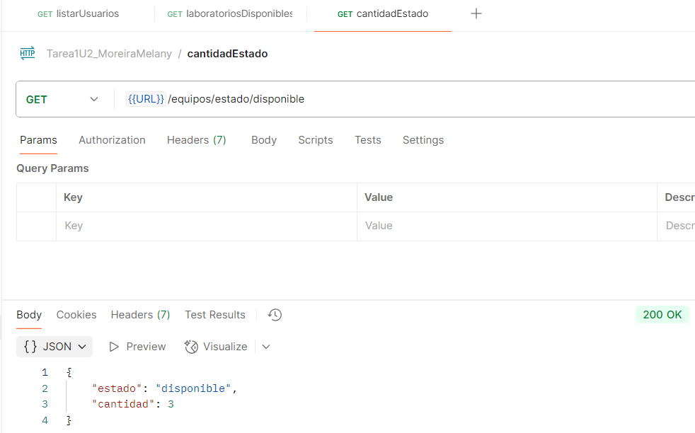

---

### Consulta 4: Buscar usuarios cuyo correo termine en @espe

**Descripción:**  
Uso de expresiones regulares con `$regex` para buscar usuarios con correos específicos.

```js
app.get('/usuarios/correo/espe', async (req, res) => {
  const usuarios = await Usuario.find({ correo: { $regex: /@espe\.edu\.ec$/ } });
  res.json(usuarios);
});
```

**Figura 6: Buscar usuarios por correo con regex**  
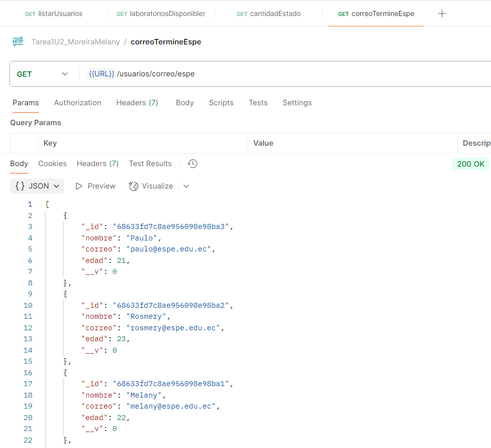

---

### Consulta 5: Usar aggregate para promedio de equipos por laboratorio

**Descripción:**  
Uso de `aggregate` con `$lookup`, `$group` y `$avg` para calcular el promedio de equipos por laboratorio.

```js
app.get('/equipos/promedio', async (req, res) => {
  const promedio = await Equipo.aggregate([
    { $group: { _id: '$laboratorio', total: { $sum: 1 } } },
    { $group: { _id: null, promedio: { $avg: '$total' } } }
  ]);
  res.json({ promedio: promedio[0]?.promedio || 0 });
});
```

**Figura 7: Promedio de equipos por laboratorio (aggregate)**  
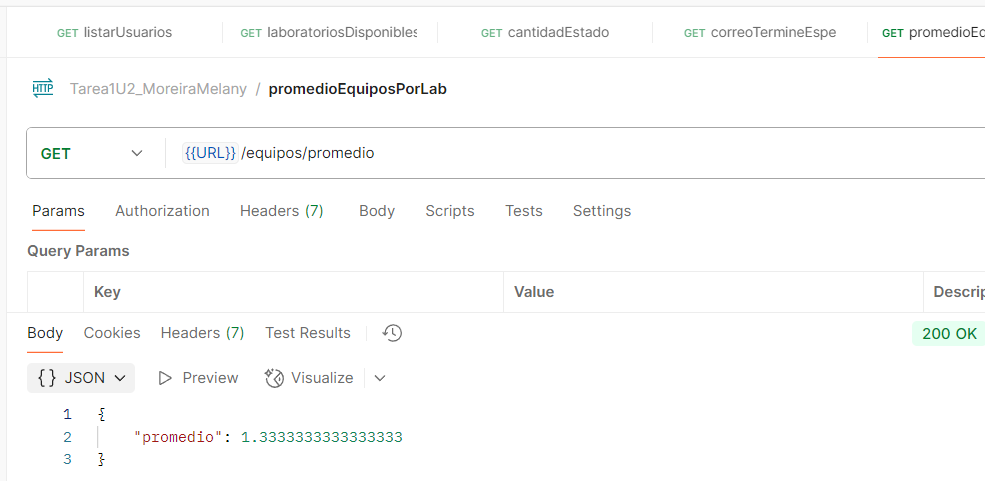

---

## Consulta 6: Relaciones entre Colecciones

Las relaciones se establecieron mediante referencias (`ObjectId`) y el uso de `.populate()` en Mongoose para obtener información asociada en las consultas.

Ejemplo de uso de `.populate()`:
```js
app.get('/equipos/:id', async (req, res) => {
  const equipo = await Equipo.findById(req.params.id).populate('laboratorio');
  res.json(equipo);
});
```
**Figura 8: Relacion entre equipos y laboratorio**  
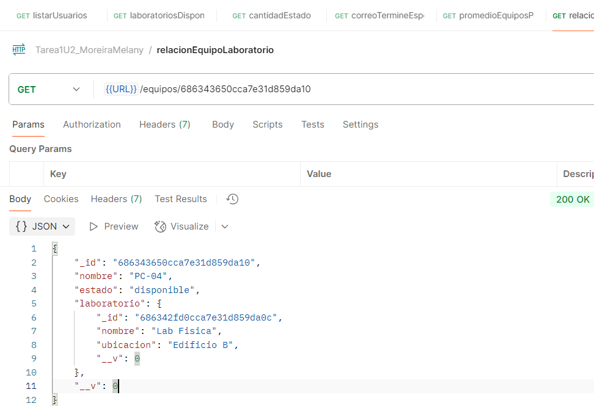

## Mongo Express Funcional
**Figura 9: Modelo Usuarios Mongo Express**  
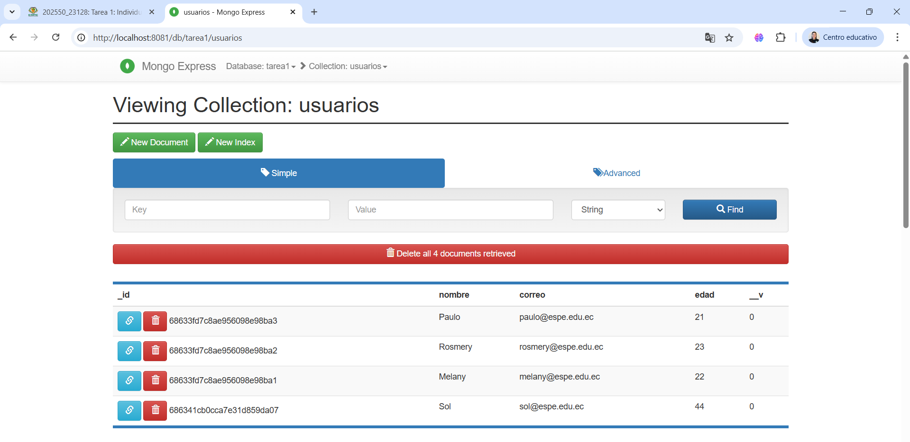
**Figura 10: Modelo Equipos Mongo Express**  
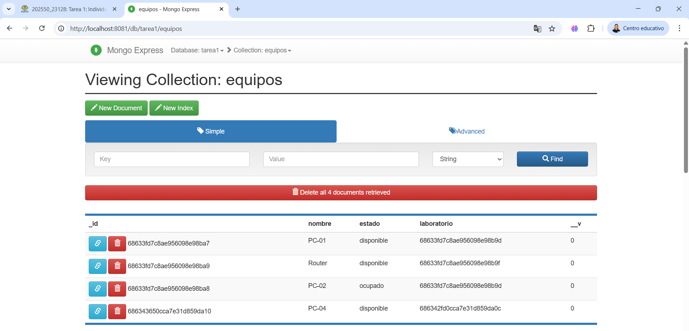
**Figura 11: Modelo Laboratorios Mongo Express**  
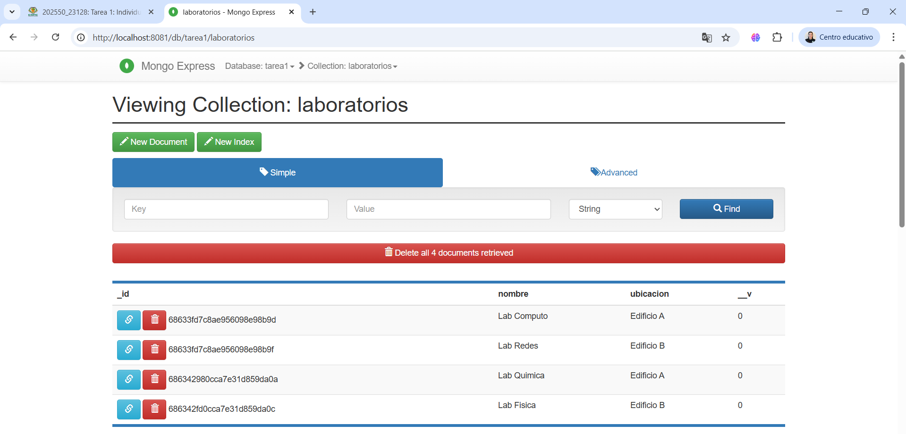
---

## Instrucciones de Ejecución

1. **Clonar el repositorio**
   ```bash
   git clone https://github.com/MelanyMoreiraZambrano/Tarea1U2_MoreiraMelany.git
   cd Tarea1U2_MoreiraMelany
   ```

2. **Levantar el entorno con Docker Compose**
   ```bash
   docker-compose up -d
   ```

3. **Configurar variables de entorno**
   - Crear el archivo `.env` según el ejemplo proporcionado.

4. **Instalar dependencias**
   ```bash
   npm install
   ```

5. **Ejecutar el proyecto**
   ```bash
   node index.js
   ```
   o
   ```bash
   npm start
   ```

6. **Acceder a Mongo Express**
   - [http://localhost:8081](http://localhost:8081)
**Figura 12: Ingreso al localhost**  
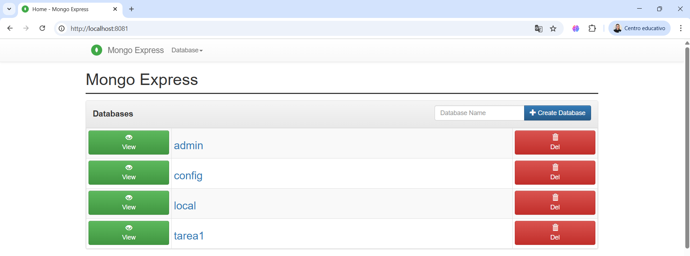

---

## Capturas de Pantalla adicionales

**Figura: Ingreso de usuarios, laboratorios y equipos**  
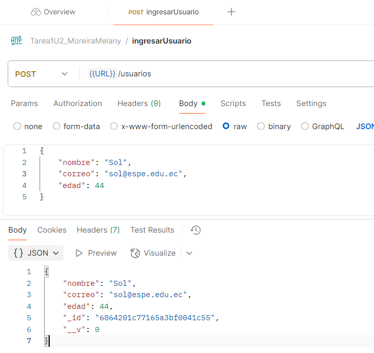
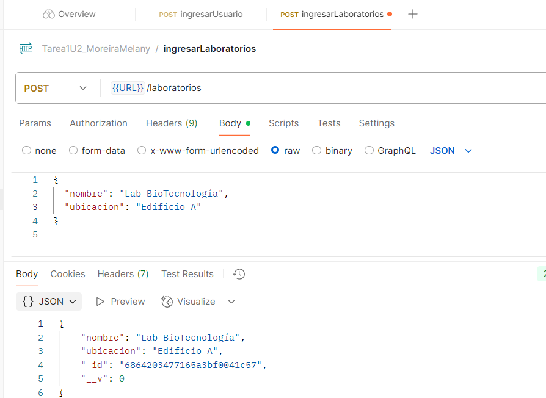
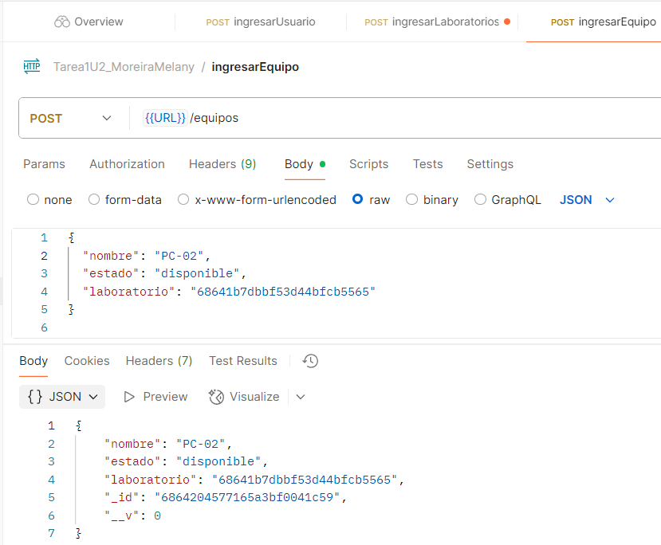

---

## Explicación de las Relaciones y Consultas Realizadas

- **Relaciones uno a muchos y muchos a uno** mediante referencias (`ObjectId`) entre laboratorios y equipos.
- **Consultas avanzadas** con operadores y agregaciones.
- **Uso de `.populate()`** para obtener datos relacionados en una sola consulta.

---

## Conclusiones

La práctica permitió reforzar el manejo de consultas avanzadas, agregaciones y relaciones en MongoDB usando Mongoose. Se comprendió la importancia de un modelado adecuado y el uso de herramientas como Docker y Mongo Express para facilitar el desarrollo y pruebas. Entre las dificultades encontradas estuvieron la correcta manipulación de referencias y la interpretación de resultados de agregaciones, resueltas revisando la documentación y mediante pruebas iterativas.

---

## Referencias

- [Documentación oficial de Mongoose](https://mongoosejs.com/docs/)
- [Documentación oficial de MongoDB](https://www.mongodb.com/docs/)
- [Documentación de Docker](https://docs.docker.com/)
- [Mongo Express](https://github.com/mongo-express/mongo-express)
- [Enlace a Github](https://github.com/MelanyMoreiraZambrano/Tarea1U2_MoreiraMelany.git)